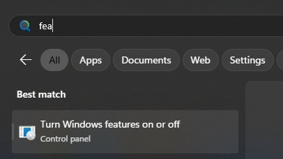
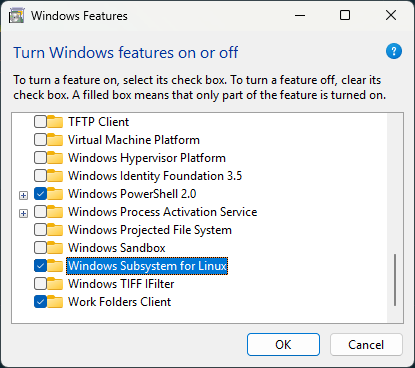
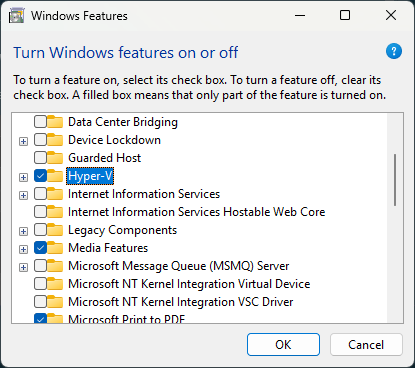

Hầu hết các ứng dụng server-side những năm gần đầy đều được triển khai trên môi trường `Linux` vì tính nhẹ, ổn định và đặc biệt là **tiết kiệm chi phí** của hệ điều hành này. Vì vậy, hầu như các dev cũng đang chuyển dịch dần sang sử dụng `Ubuntu` cho việc lập trình để có được môi trường `dev` giống với môi trường `Production` nhất có thể hoặc đơn giản là dự án được cấu hình chỉ có thể chạy trên Linux. Nhưng môi trường công ty đôi khi lại yêu cầu bạn phải sử dụng những phần mềm mà chỉ có thể chạy được hoặc chạy ổn định hơn trên windows như Office,...

Vậy thì đây là bài viết dành cho bạn, giúp bạn giải quyết các vấn đề chạy song song giữa Ubuntu và Windows một cách thuận tiện nhất.

## Cài đặt Ubuntu trên Windows bằng WSL (Windows Subsystem for Linux)

### 1. Bật các feature cần thiết trong windows

1. `Window + S` -> Tìm kiếm "Turn Windows Features on or off"



2. Bật WSL và Hyper-V

Sau khi tick 2 mục như trong ảnh, sau đó "OK" rồi đợi Windows cài đặt và khởi động lại máy.



Mục `Hyper-V` chúng ta nên cài nhé. Vì trong quá trình cài đặt, mình đã gặp lỗi vì không bật nó lên.


### 2. Cài 1 distro Linux bằng WSL

Trong hướng dẫn này tôi sử dụng `powershell`, bạn cũng có thể sử dụng `CMD` để chạy các lệnh nhé.

Ngoài ra, tôi chỉ tổng hợp các lệnh cần thiết chạy lần lượt để cài Ubuntu để tiện cho việc cài đặt sau này của tôi. Các bạn có thể tham khảo thêm ở trên mạng cho những cách cài đặt khác nhé.

Set mặc định **version của WSL = 2**

```powershell
wsl.exe --set-default-version 2

```

Xem danh sách các distro có thể cài trên WSL

```powershell
wsl --list --online

```

Output:
```
The following is a list of valid distributions that can be installed.
Install using 'wsl.exe --install <Distro>'.

NAME                            FRIENDLY NAME
AlmaLinux-8                     AlmaLinux OS 8
AlmaLinux-9                     AlmaLinux OS 9
AlmaLinux-Kitten-10             AlmaLinux OS Kitten 10
AlmaLinux-10                    AlmaLinux OS 10
Debian                          Debian GNU/Linux
FedoraLinux-42                  Fedora Linux 42
SUSE-Linux-Enterprise-15-SP6    SUSE Linux Enterprise 15 SP6
SUSE-Linux-Enterprise-15-SP7    SUSE Linux Enterprise 15 SP7
Ubuntu                          Ubuntu
Ubuntu-24.04                    Ubuntu 24.04 LTS
archlinux                       Arch Linux
kali-linux                      Kali Linux Rolling
openSUSE-Tumbleweed             openSUSE Tumbleweed
openSUSE-Leap-15.6              openSUSE Leap 15.6
Ubuntu-18.04                    Ubuntu 18.04 LTS
Ubuntu-20.04                    Ubuntu 20.04 LTS
Ubuntu-22.04                    Ubuntu 22.04 LTS
OracleLinux_7_9                 Oracle Linux 7.9
OracleLinux_8_10                Oracle Linux 8.10
OracleLinux_9_5                 Oracle Linux 9.5

```

Cài đặt distro bằng `Name` của distro ở trên

```powershell
wsl --install -d Ubuntu-24.04

```

Nếu gặp output như bên dưới _(`wsl` thấy mình chưa bật đủ các feature nên tự enable)_ thì khởi động lại máy và chạy lại lệnh cài đặt ở trên nhé. 

```
The requested operation requires elevation.
Installing Windows optional component: VirtualMachinePlatform

Deployment Image Servicing and Management tool
Version: 10.0.26100.1150

Image Version: 10.0.26100.4946

Enabling feature(s)
[==========================100.0%==========================]
The operation completed successfully.
The requested operation is successful. Changes will not be effective until the system is rebooted.
The requested operation is successful. Changes will not be effective until the system is rebooted.
```
Đến đây thì **Khởi động lại máy** rồi đi tiếp nhé


Sau khi chạy lệnh cài distro thành công, màn hình sẽ yêu cầu chúng ta nhập các thông tin `username`, `password` để khởi tạo hệ điều hành.

```
Downloading: Ubuntu 24.04 LTS
Installing: Ubuntu 24.04 LTS
Distribution successfully installed. It can be launched via 'wsl.exe -d Ubuntu-24.04'
Launching Ubuntu-24.04...
Provisioning the new WSL instance Ubuntu-24.04
This might take a while...
Create a default Unix user account: dzung
New password:
Retype new password:
passwd: password updated successfully
To run a command as administrator (user "root"), use "sudo <command>".
See "man sudo_root" for details.
```

Đến đây là chúng ta đã thành công cài đặt Ubuntu chạy song song với Windows rồi.

Việc làm tiếp theo là cài đặt các package cần thiết để sử dụng môi trường Ubuntu và tận hưởng thôi.

Nhu cầu của tôi thì hay dùng Ubuntu để chạy `docker` vì bản chất `docker` không dành cho `windows`. Nên việc đầu tiên sau khi cài Ubuntu là [cài đặt Docker](/blog/huong-dan-su-dung-docker) 😉


## Các lệnh hay sử dụng với wsl

### 1. Kiểm tra danh sách distro đã cài trong wsl

```powershell
wsl -l -v

```

Ouput
```
  NAME            STATE           VERSION
* Ubuntu-24.04    Running         2
```

**Kiểm tra kỹ Version phải là 2 thì mới chạy được full tính năng của Ubuntu nhé**


### 2. Khởi chạy distro

```powershell
wsl -d <DistroName>

```

`DistroName` lấy ở lệnh trên nhé.

VD:
```powershell
wsl -d Ubuntu-24.04

```

Sau đó, chúng ta sẽ vào giao diện terminal của Ubuntu (Có thể nói nó giống như chúng ta đang SSH vào Ubuntu vậy).